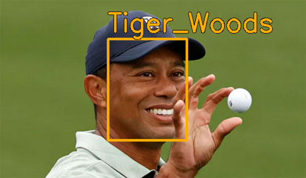
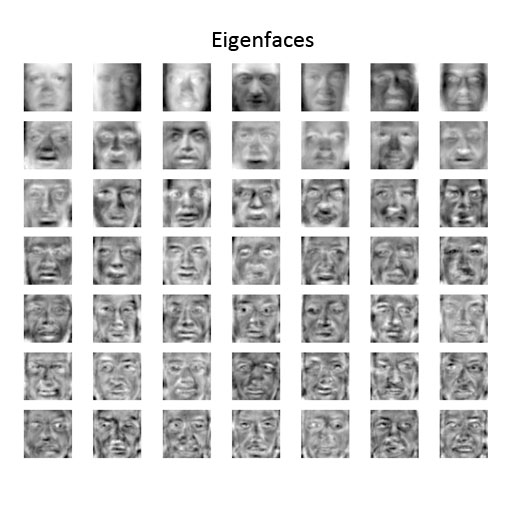
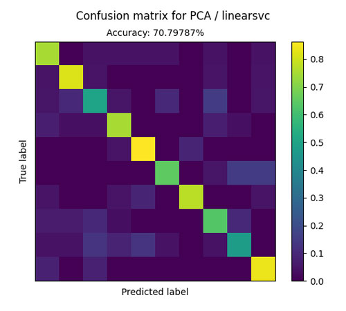
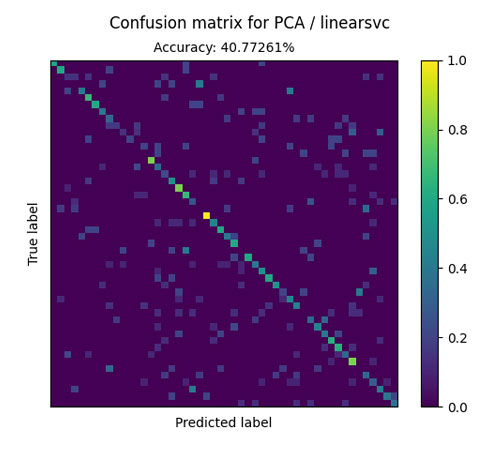

# Face Recognition From Scratch with Principal Component Analysis

Principal Component Analysis (PCA) is a statistical method that can be used for face recognition. However, it is more or less outdated, and current face recognition models normally use convolutional neural networks (CNN) to achieve higher accuracy.

This project aims to use PCA to build a working face recognition system from scratch, and compare its performance with state of the art CNNs.



## How it works

A big problem with face recognition is the large number of variables in an image. For example, a 64x64 image will already consist of 4096 variables (pixels). Checking and comparing each pixel is extremely inefficient and easily affected by changes in lighting or background.

PCA tackles this problem by reducing the number of variables in an image. Using a technique called eigendecomposition, PCA breaks down each face into several different components, called eigenfaces. 

The idea is that every person's face is a weighted combination of these "eigenfaces" - and to recognize a new face, we only need to measure how much of each eigenface it consists of.



Honestly, they look pretty scary. You can also see other interesting stuff like the "average face", calculated based on all the faces in the dataset.

## Using the program

First, clone or download the repository.

```
git clone https://github.com/ChaseLean/pca-face-recognition
```

1. To detect some faces, first create a new folder of your choice eg. `my_dataset` inside `datasets`. 

2. Inside `my_dataset`, create a folder for each person inside your dataset.

3. Then, place an image of the face(s) eg. `my_pic.jpg` that you want to recognize inside `test_images`. 

4. Finally, inside `inference.py`, run the following function:

```
model_inference(img_path="test_images/my_pic.jpg", db_path="datasets/my_dataset")
```
The function returns `predictions`, the predicted name, `results`, the cropped face image(s) and their coordinates and `img`, the annotated original image.

## How accurate is it?

To put it into practice, I used a subset of the [Labeled Faces in the Wild (LFW)](http://vis-www.cs.umass.edu/lfw/) dataset.

<p align="center">
    
</p>

Randomly selecting 10 individuals with 20-30 faces each (total 236) and using 50 principal components, the Euclidean distance classifier got an accuracy of 20%. Absolutely terrible.

It turns out that preprocessing the data is very important in almost all machine learning algorithms. To do this, I first cropped and centered the faces using Retinaface (a face detection library). Then, I applied image standardization. This raised the accuracy to just 26%.

Observing the eigenfaces, it seemed like the first 5 principal components captured the lighting, rather than the shape of the face. Therefore, I decided to remove them, and the accuracy jumped to 50%.

Using 5-nearest neighbors as a classifier, this improved to 55%.

Meanwhile, the linear support vector classifier (SVC) gave an even better accuracy of 72%. Not too bad.

However, the recognition accuracy quickly degrades when more faces are added. Using 50 different people, the accuracy went down to 41%.

<p float="left">
  
   
</p>

You can run the evaluation using your own data by running `pipeline.py`, with `is_show_metrics=True`.

It is important to note that LFW is a hard dataset for face recognition, with multiple face orientations and different lighting conditions. Many PCA tutorials online will report accuracies of above 90% - this is possible only with very structured datasets, with the same pose and lighting.

Furthermore,


